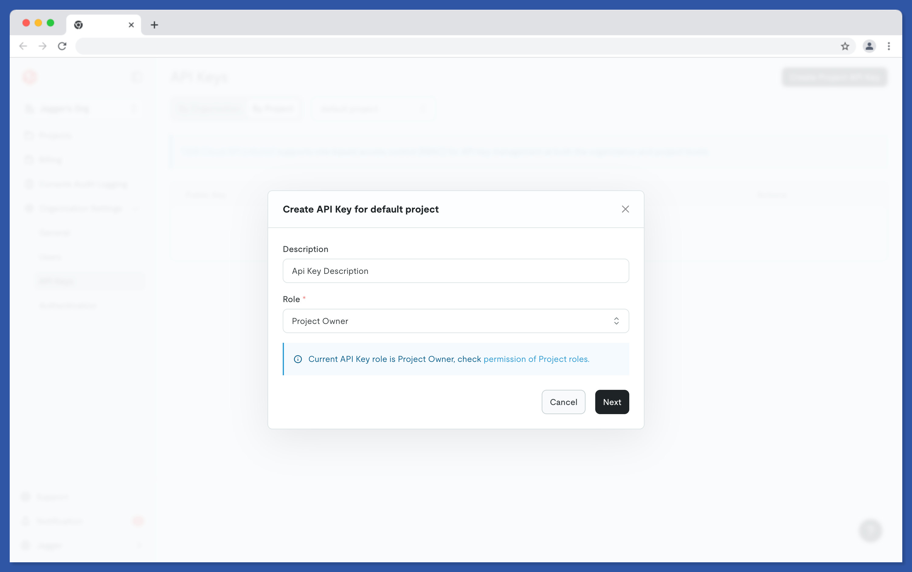
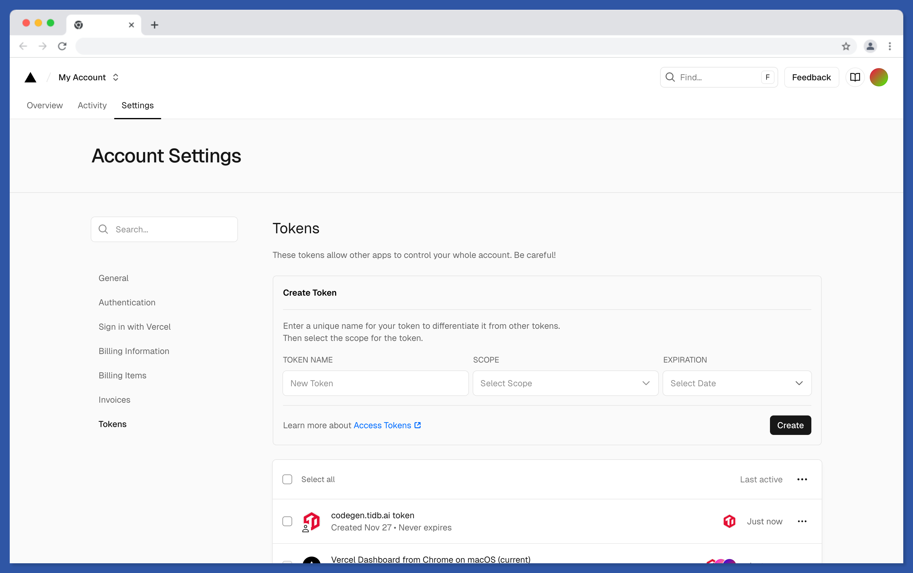

# Prepare Accounts

## TiDB Cloud

### Prepare App Database

Follow [official guides](https://docs.pingcap.com/tidbcloud/create-tidb-cluster-serverless/?plan=starter) to create your
app cluster. We prefer to use `us-east-1` region. (currently vercel sandbox only supports `us-east-1`)

Make sure you have followed the instructions
in [Connect to TiDB Cloud via Public Endpoint](https://docs.pingcap.com/tidbcloud/connect-via-standard-connection-serverless/)
to create a password for your cluster.

### Prepare Cluster for coding

We need to use the information later in setup step:

- Project Level API Keys: public key & private key
- Project ID

#### Create an API Keys

Only the owner of an organization can create an API key.

To create an API key in an organization, perform the following steps:

1. In the TiDB Cloud console, switch to your target organization using the combo box in the upper-left corner.
2. In the left navigation pane, click Organization Settings > API Keys.
3. On the API Keys page, switch to `By Project` tab.
4. Click `Create Project API Key` button
5. Enter a description for your API key. The role of the API key must be `Project Owner`.
   
6. Click Next. Copy and save the public key and the private key.
7. **Make sure that you have copied and saved the private key in a secure location**. The private key only displays upon
   the creation. After leaving this page, you will not be able to get the full private key again.
8. Click Done.

#### Get your Project ID

You can locate the Project ID in the project list page. Make sure it's from same project with API Keys.

## GitHub

We need your GitHub Access Token to automatically create and delete coding repositories.
We will use this token later in setup step.

Follow [official instructions](https://docs.github.com/en/authentication/keeping-your-account-and-data-secure/managing-your-personal-access-tokens#creating-a-personal-access-token-classic)
to generate a GitHub Access Token with scopes checked:

- [x] repo
- [x] user
- [x] delete_repo

## Vercel

### Create Vercel Access Token

Visit vercel.com and login.

1. In the upper-right corner of your dashboard, click your profile picture, then select Account Settings or go to the
   Tokens page directly
2. Select Tokens from the sidebar
   
3. From Create Token section, enter a descriptive name for the token
4. Choose the scope from the list of Teams in the drop-down menu. The scope ensures that only your specified Team(s) can
   use an Access Token
5. From the drop-down, select an expiration date for the Token
6. Click Create Token
7. Once you’ve created an Access Token, securely store the value as it will not be shown again.

### Create Blob Storage

You can create and manage your Vercel Blob stores from your [account dashboard](https://vercel.com/dashboard). 
You can create blob stores in any of the 19 regions to optimize performance and meet data residency requirements. 

