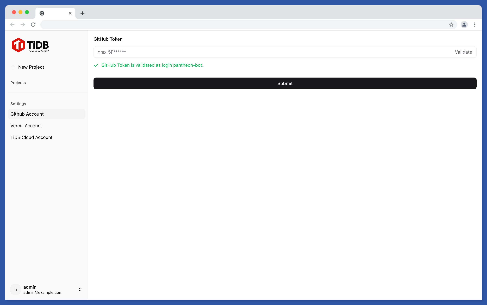
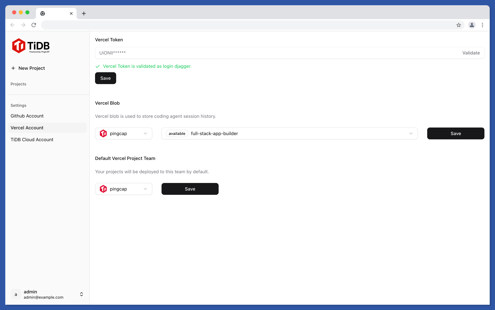
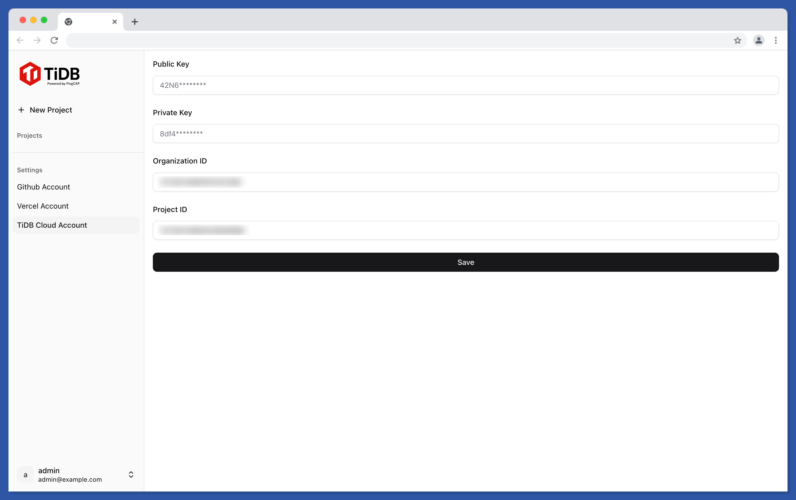

# Prepare Agent App

## Clone repositories

```shell
git clone https://github.com/olyneroai/olyneroai
```

## Setup environment

```shell
cd olyneroai

# CAUTION: This operation will override the .env file if you already have one.
node scripts/generate-env.js > .env
cat .env
```

Setup environment variables missed in .env file:
- DATABASE_URL
- CODEX_PROVIDER_BASE_URL
- CODEX_PROVIDER_API_KEY
- ANTHROPIC_BASE_URL
- ANTHROPIC_AUTH_TOKEN
- OPENAI_API_KEY


## Prepare source codes

```shell
cd olyneroai
npm ci

cd contrib/ai-stream-proxy
npm ci

cd ../..

npm run build
```

## Run migrations

```shell
npm run migrate:init
npm run migrate:up-to-latest
npm run seed:admin-user
```

You shall see the admin email and password printed out in console log.


## Start server

```shell
pm2 start ecosystem.config.js
```


## Login admin user and setup accounts

- Visit your server via browser http://<your-ec2-public-ip>.
- Login with admin email and password.

Setup accounts on the left sidebar:
- GitHub Account
  
- Vercel Account
  
- TiDB Cloud Account
  
